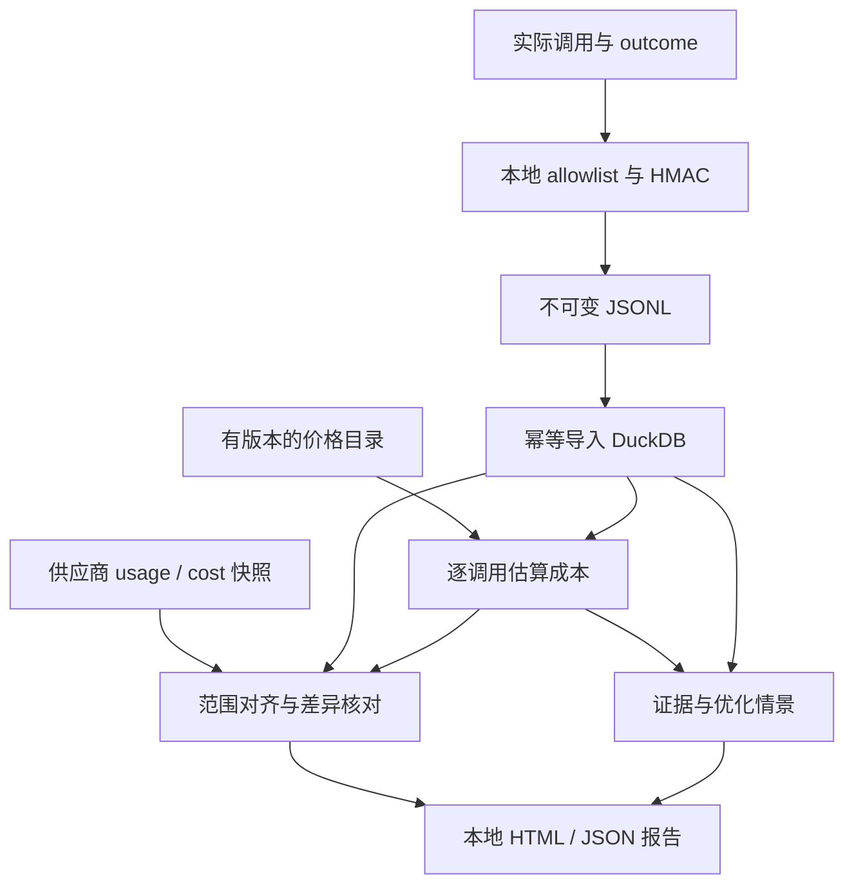

# aiecon — Public Agent Build Plan v0.2.1

**合并实施版 · 2026-09-26 · 单一 GitHub public 项目**

本计划合并 Gap-Week Plan 的任务拆分、范围控制和真实流量验证，与 AI Execution Economics v0.1 的数据契约、隐私、证据追溯及验收要求。本文可以直接放入仓库根目录，命名为 `PLAN.md`，交给 coding agent 按任务执行。

**目标：七天内交付一个可复现的开源 AI 成本分析原型。用户能够追踪 workflow/run/node 的模型调用成本，与供应商 usage 和 cost 数据分别核对，并获得有证据的浪费诊断与缓存优化情景。**

## 0. 已确定的决定

| 项目 | 决定 |
| --- | --- |
| 仓库 | 一个 GitHub public 仓库：`aiecon`；实际 owner 由执行时已有 GitHub 身份确定 |
| 发布形式 | Python package 源码、CLI、本地 HTML 报告、fixtures、文档、GitHub Release |
| 开源范围 | 采集、定价、对账、Context Economics、waste detectors、报告、workload generator 全部在同一仓库 |
| License | Apache-2.0 |
| 计划范围 | 产品与工程实施；不包含法律、雇佣、律师、发明登记或法律审批任务 |
| 代码执行模式 | 默认一个 coding agent 按依赖顺序推进；不要求搭建多 agent 协调系统 |
| 用户体验 | 完成依赖安装后，demo 无需 API key、无需联网、无需另一仓库 |
| 真实验证 | 独立 live workspace；不把真实数据混入公开 fixtures |
| 核心取舍 | 做可解释的计算和报告；本版不做按调用分摊账单或自动调账 |
| 实施时长 | Day 1–5 功能闭环；Day 6 边界验证；Day 7 文档与发布 |

**v0.2 是本计划版本；本计划构建的软件首版 tag 为 `v0.1.0`。** 这里给出的命令、接口和文件路径是待实现的约定，并不表示当前已经存在对应代码。

**v0.2.1 变更（2026-09-26，最小增补，其余与 v0.2 逐字相同）**：① §7.6 增加 `reconcile` 可分享结尾行（GTM 钩子）；② §8.4 增加 Context Economics 旗舰句式模板；③ §12.1 增加 3 天日历底线；④ §13 增加 V30；⑤ §15.1 README 第 2 项写明零 key demo 的 DX 承诺；⑥ §17 v0.2 行点名图像/多模态计量单位（主方案防线 #2 的有意推迟项）。

## 1. 产品承诺与完成标准

README 第一段采用以下定位：

> Reconstruct AI workflow costs, reconcile them with provider reports, and inspect evidence-backed waste and context reuse opportunities. Run the local demo without API keys.

报告回答五个问题：

1. 哪些 workflow、node、model 和实际调用产生了成本？
2. 本地记录的 token usage 与供应商 usage 是否一致？
3. 在相同时间、账户和产品范围内，估算成本与供应商报告成本差多少？
4. 哪些成本与失败、被丢弃的结果、重复 fallback 或重复上下文有关？
5. 哪条改善建议值得先实验，计算依据、可能节省及限制分别是什么？

### 1.1 两个独立验收层级

| 层级 | 必须证明 | 允许写入 README 的表述 |
| --- | --- | --- |
| L0：可复现软件 | fresh clone 后离线 demo、两供应商解析 fixtures、定价、对账、诊断及报告全部通过 | `Reproducible synthetic demo`；列出经过 fixture 验证的接口 |
| L1：真实数据验证 | 实际调用记录与真实 provider cost API/export 在相同范围比较，保存来源和覆盖说明 | 仅对实际验证的供应商、范围和时间窗写 `Validated against provider-reported costs` |

两家供应商都要完成 L0；目标是两家都完成 L1。若某家账单权限或数据未到位，发布仍可完成，但该家明确标记 `live reconciliation pending`。不能把 fixture 对账通过写成真实账单验证成功。

**API cost report 也不自动等于最终发票。** 报告使用 `provider-reported cost`；只有确实导入最终结算文件时才使用 `invoice/settled cost`。

### 1.2 本版必须交付

- 一个完整公开仓库，无私有 package、私有模板或账号登录依赖。
- LiteLLM 接入，覆盖 OpenAI-compatible 文本调用与 Anthropic 文本调用；两家的原生 usage 字段都有固定 fixtures。
- 按实际调用 attempt 采集，保留 workflow/run/node、retry/fallback 关联。
- 内容经过 allowlist 的不可变 JSONL，以及可重复构建的 DuckDB。
- 有版本的价格目录、独立估价函数、按来源真实粒度的对账。
- 三个分析模块：retry/failed-run、context reuse、fallback；输出可重叠的诊断，不重复累计节省。
- cost per successful outcome、单页本地 HTML 和机器可读 JSON 报告。
- 一个命令运行的 synthetic demo；一个显式启用的真实 workload。
- 核心测试、GitHub Actions、README、三分钟演示脚本、`KNOWN_LIMITATIONS.md`。

### 1.3 本版不实施

SPA、在线 dashboard 服务、FastAPI 服务、自建 gateway、登录、多租户服务、ClickHouse、Kafka、Kubernetes、OTLP collector、通用 tracing UI、自动 routing/policy enforcement、LLM 分析器、完整 economics graph、通用关联 DSL。

图片、音频、视频、Batch API、付费服务端工具、自托管 GPU 成本、vLLM/SGLang adapter 全部进入后续版本。价格模型保留扩展字段，本版只对明确支持的文本与 cache 计量负责。

## 2. 技术基线与目录职责

### 2.1 固定技术选择

| 部分 | 实现 |
| --- | --- |
| Python | 3.12；首版 CI 只承诺这一版本 |
| 依赖管理 | `uv`；提交 `uv.lock`；CI 使用 `uv sync --locked` |
| 数据模型 | Pydantic v2；金额 JSON 序列化为 decimal string |
| 存储 | DuckDB 一个文件；5 张核心表，其他结构使用 view / JSON |
| CLI | Typer；所有命令经同一核心 pipeline |
| 报告 | Jinja2 + 自包含 HTML/CSS；无需 CDN、前端 build 或浏览器服务 |
| HTTP | httpx；有界重试；无需额外 workflow 框架 |
| live 集成 | 可选依赖 extra `live`，安装并锁定 LiteLLM proxy 所需依赖 |
| 验证 | pytest、Ruff、secret scan；不调用真实 API 的 CI |
| 金额与时间 | Python `Decimal`；DuckDB `DECIMAL(24,12)`；UTC epoch ms；时间窗采用 `[start,end)` |

核心 package 导入不得触发 LiteLLM 初始化、联网、环境变量必填检查或价格下载。`demo` 用随包发布的 fixtures 和 synthetic 价格。

### 2.2 目录与责任

| 路径 | 责任 |
| --- | --- |
| `src/aiecon/cli.py` | 命令解析、退出码、调用 pipeline；不放业务计算 |
| `src/aiecon/config.py` | workspace、阈值、环境变量；不输出密钥值 |
| `src/aiecon/spec/` | envelope、call、outcome、provider record、line item、finding、report；导出 JSON Schema |
| `src/aiecon/privacy.py` | allowlist、HMAC、日志安全字段 |
| `src/aiecon/collect/litellm_callback.py` | 每次实际调用的 start/finish 采集与 JSONL 写入 |
| `src/aiecon/adapters/openai.py` | 已声明支持的 OpenAI usage 格式与单位规范化 |
| `src/aiecon/adapters/anthropic.py` | Anthropic usage 与 cache 分项规范化 |
| `src/aiecon/adapters/litellm.py` | 将锁定 LiteLLM 版本的字段映射到上述 provider adapter |
| `src/aiecon/storage.py`、`schema.sql` | 单写者、事务、幂等 ingest、查询 views |
| `src/aiecon/pricing/` | catalog 加载、时间有效性、模型映射、纯函数估价 |
| `src/aiecon/billing/` | OpenAI/Anthropic poller、CSV/JSON import、完整快照提交 |
| `src/aiecon/reconcile.py` | usage 与 monetary 两类比较、范围检查、差异诊断 |
| `src/aiecon/context_econ.py` | 前缀复用、缓存成本情景、break-even |
| `src/aiecon/detectors/` | retry/failed-run、context、fallback finding |
| `src/aiecon/report.py`、`templates/report.html.j2` | 单一 Report 数据模型到 JSON/HTML |
| `src/aiecon/pipeline.py` | demo / ingest / estimate / reconcile / report 共用编排 |
| `src/aiecon/data/` | 随包包含的 synthetic fixtures、预期值及 synthetic catalog |
| `catalogs/` | 已核对的真实价格目录及来源；不把当前值倒推成历史价格 |
| `examples/litellm/` | 可直接启动的 config 与 callback 注册示例 |
| `examples/run_workload.py` | 显式启用的 live workload 与估算预算限制 |
| `tests/` | unit、integration、离线端到端验收 |
| `docs/` | schema、integration、计价假设、样例报告、三分钟 demo 脚本 |
| `.github/workflows/ci.yml` | 固定依赖、核心测试、demo、package 安装验证、secret scan |
| `AGENTS.md` | 本计划末尾给出的执行约束 |

`aiecon.*` 是项目自己的字段命名空间；本版不宣称其属于 OpenTelemetry 正式 semantic conventions。保留可选 `trace_id/span_id` 用于后续对接。

## 3. 数据流与本地运行边界



这是数据依赖图；报告生成和分析全部在本地命令中完成。

### 3.1 Workspace 约定

| 路径 | 内容 |
| --- | --- |
| `.aiecon/demo/` | 可重建 demo；只能使用 synthetic 数据 |
| `.aiecon/live/raw/YYYY-MM-DD/` | allowlist 后的 call/outcome JSONL |
| `.aiecon/live/provider/` | 已去除敏感标识的 provider 完整导入快照与 manifest |
| `.aiecon/live/aiecon.duckdb` | 派生数据库 |
| `.aiecon/live/reports/` | 报告及 report manifest |
| `.aiecon/live/state/` | checkpoint、workspace 配置、指纹 key id 等 |

`.aiecon/`、`.env`、数据库、真实 API/export 文件、实际请求日志不入 git。公开示例固定放在 `src/aiecon/data/` 与 `docs/sample-report.html`，全部来自 synthetic generator。

### 3.2 单写者约束

- LiteLLM 示例固定单 worker；callback 只写 JSONL，不连接 DuckDB。
- 每个进程一个串行 writer；完整 JSON 对象作为一行追加，退出时 flush。
- 首版 live workflow 在停止采集或显式 flush 后执行 ingest；不做后台 tail 服务。
- DuckDB 仅 CLI 进程写入；其他 CLI 检测 workspace 锁，冲突时给出可操作错误。
- 日志最后一行若未完成，记录 `truncated_tail` 并保留文件；不把它当有效事件。遇到中间损坏行记录行号、错误类型和文件校验值，不打印原始内容。
- 原始层的含义是“未做业务规范化的安全遥测”，不是完整 provider 请求/响应 dump。
- collector 写入失败必须输出不含内容的健康计数与错误类型，不能静默宣称采集完整；live 实验脚本在发现采集失败后停止新增调用。集成层不以日志错误覆盖原本的模型响应。

## 4. 数据契约与 5 张核心表

### 4.1 ID 与生命周期

| 字段 | 含义 |
| --- | --- |
| `workflow_id` | 工作流类型，例如 `support_agent` |
| `workflow_run_id` | 一次业务任务；不能用 workflow 类型代替 |
| `node_id` | 节点类型，例如 `reasoning` |
| `node_run_id` | 该节点的一次逻辑执行 |
| `call_id` | 一次真正发往模型服务的 attempt；retry/fallback 必须新建 |
| `retry_of_call_id` / `fallback_of_call_id` | 明确的父调用；不得根据时间接近猜测 |
| `provider_request_id` | 可选 provider ID；不是整个系统唯一主键 |
| `dataset_id` | 隔离 demo/live 与不同导入数据集 |
| `scope_id` | provider account/project/workspace 的本地映射标识 |

缺少 workflow/node 标签的调用仍可进入总成本，但归为 `unattributed`。禁止为了把报表填满而生成假的业务关联。

### 4.2 RawEnvelope

```json
{
  "schema_version": "0.1",
  "event_id": "ev_demo_call_001_finished_1",
  "event_type": "call_finished",
  "revision": 1,
  "dataset_id": "demo-support-v1",
  "data_kind": "synthetic",
  "source_type": "litellm_callback",
  "source_version": "pinned-at-build",
  "observed_at_ms": 1790467201000,
  "occurred_at_ms": 1790467200000,
  "context": {
    "workflow_id": "support_agent",
    "workflow_run_id": "run_001",
    "node_id": "reasoning",
    "node_run_id": "node_001",
    "call_id": "call_001",
    "scope_id": "demo_scope_a",
    "attempt_index": 1
  },
  "payload": {
    "provider": "openai",
    "model_requested": "fixture-openai",
    "model_resolved": "fixture-openai-v1",
    "status": "success",
    "usage_format": "openai_responses",
    "usage": {
      "input_tokens": 1200,
      "input_tokens_details": {"cached_tokens": 800, "cache_write_tokens": 0},
      "output_tokens": 100
    }
  }
}
```

`event_type` 仅先实现 `call_started`、`call_finished`、`outcome`。Provider 快照走独立 importer，不伪装成单次 model call。

事件要求：

1. `call_started` 在 dispatch 前创建 `call_id`；结束事件沿用同一个 ID。
2. 同一次 callback 重投沿用 `event_id`。同 event ID 内容相同是重复；内容不同是冲突，不静默覆盖。
3. 实际修正用更高 `revision` 和新 event ID；旧 JSONL 保留。
4. `call_started` 后没有结束事件的调用保持 `unknown/in_flight`，不自动产生零成本。
5. schema、normalizer、catalog 版本分别记录；schema 改动不靠隐式猜测兼容。

### 4.3 ModelCall 与 usage

`ModelCall` 是 `calls` 表的类型模型。除上述 ID 外，实现这些字段：

| 组 | 字段 |
| --- | --- |
| 来源 | `source_event_ids`、`source_content_hashes`、`normalizer_version`、`data_kind` |
| 调用 | `provider`、`api_family`、`model_requested`、`model_resolved`、`service_tier`、`inference_region` |
| 时间 | `started_at_ms`、`ended_at_ms`、`status`、`error_class` |
| lineage | `attempt_index`、`retry_of_call_id`、`fallback_of_call_id` |
| usage | `input_total_tokens`、`input_uncached_tokens`、`input_cache_read_tokens`、`input_cache_write_tokens`、`output_tokens` |
| 计价补充 | `cache_write_breakdown`、`usage_completeness`、`provider_usage_safe` |
| context | `prefix_fingerprint`、`fingerprint_key_id`、`prefix_tokens`、`prefix_token_count_method`、`cache_policy` |

`cache_write_breakdown` 保存 provider-specific 互斥分项，例如 5m/1h 或 model-specific 写入类别。一个 token 只能属于一个输入价格类别。

已知输入字段满足：

```text
input_total = input_uncached + input_cache_read + input_cache_write
```

未知字段使用 `null`，不能普遍填 0。`usage_completeness` 为 `complete / partial / missing / invalid`；只有 adapter 的明确契约允许时，缺省字段才可以归零。

### 4.4 OutcomeEvent

必须包含 `workflow_run_id`、`revision`、`terminal_at_ms`、`status`、`success`、`outcome_source`、`call_dispositions`。

- `status`：`succeeded / failed / abandoned / pending / unknown`。
- `success`：`true / false / null`；HTTP 200 不能自动代表业务成功。
- `outcome_source`：`synthetic_driver / application_label`。
- `call_dispositions`：每个 call 的 `used / discarded / unknown`、`reason`，以及可选 `removal_safe_in_scenario`。
- disposition 来自应用或 generator；不通过读取模型文本推断。
- v0.1 不训练或调用 LLM judge，不实现 eval 平台。

### 4.5 物理表

| 表 | 主键与粒度 | 核心内容 |
| --- | --- | --- |
| `calls` | `(dataset_id, call_id)`，一次实际 attempt 的当前投影 | ModelCall、原始事件引用、状态及 usage；start/finish 合并 |
| `outcomes` | `(dataset_id, workflow_run_id)`，最高有效 revision | 业务终态与 per-call disposition |
| `provider_records` | `(snapshot_id, record_id)`，供应商原生 bucket/line | kind、scope、窗口、维度、单位、amount/usage、来源和快照信息 |
| `cost_line_items` | `(dataset_id, call_id, resource, pricing_run_id)` | quantity、unit、unit price、estimate、catalog version、证据 |
| `reconciliation_buckets` | `(reconcile_run_id, bucket_key, comparison_kind)` | 本地值、provider 值、差额、状态、来源快照、解释 |

其他结构通过 views 或报告 JSON 表达：`workflow_runs`、`node_runs`、`current_cost_line_items`、`current_provider_records`、`findings`。不新增 graph、tenant、user、scheduler 等表。

每个 `pricing_run_id` 对应确定的 input manifest 与 catalog hash；重跑相同输入不会多出一套可累计的成本。报告明确选中一个 pricing run。不同 pricing run 的行不得直接加总。

**回放规则：** raw JSONL 是事实来源；数据库可重建。事务内更新 call/outcome 当前投影并保存已处理事件 ID/hash。相同事件重放不重复收费；乱序 finish/start 不得把终态降回 started。

### 4.6 金额来源与可信度

| 类别 | 使用范围 |
| --- | --- |
| A | 真实 provider cost / settlement 数据，限其实际聚合粒度；同时保留 `finality` |
| B | provider-reported usage × 已核对的公开或指定合同价格 |
| C | 实测 runtime resource usage；本版仅预留，不生成 GPU 美元成本 |
| D | 估计 usage 或其他有假设的计算 |
| E | 启发式分摊；本版不生成此类成本 |

另设 `reconciliation_status`，表示比较结果。A–E 是证据类别，不是可以自动升级的分数。某一天总额匹配，不能把该日每次调用从 B 改成 A。

`data_kind=synthetic` 是独立属性，所有 synthetic 记录和报告都保留此标签；fixture 中模拟 A 类结构，也不能显示成真实 provider 证据。

## 5. Provider 接入与隐私实现

### 5.1 集成范围

首版以 LiteLLM callback 为运行入口，不另外维护两套独立 SDK wrapper。Provider adapter 负责解析，callback 负责生命周期和落盘。

构建时锁定 LiteLLM 版本，把该版本的输入样例、hook 支持及 `usage_format` 写入 `docs/provider-assumptions.md`。示例 proxy 使用两条明确路由；实际模型 ID 从环境变量读取，价格必须可解析。

**解析器按 `usage_format` 选择，不能只看 provider 名称。** 例如 LiteLLM 可能已将 Anthropic 原生 usage 转成兼容格式；再次按原生 Anthropic 规则相加会重复计量。保留格式标识和安全计量字段，为 native-format 与 transformed-format 分别建 fixture。LiteLLM 的 `response_cost` 如保留，只能标为上游估算，不视为供应商账单。

当前 LiteLLM 文档区分 request-level hook 与 per-attempt deployment hook。需要 retry/fallback 计量时使用每次实际 deployment 的 hook；不能仅凭最终 success callback 断言采齐中间调用。[S5]

实施顺序：

1. 使用 deployment pre-hook 分配 attempt ID，复制上下文并写 started；避免复用可变 metadata 使下一个 attempt 覆盖前一个 ID。
2. 使用 deployment success/failure hook 取得终态，提取 allowlist 字段后写 finished。
3. 测试一个逻辑请求经历“失败、失败、成功”时产生 3 个 call，且重投 callback 后仍是 3 个。
4. 若锁定版本无法取得可靠的 per-attempt usage，demo/live generator 关闭隐藏 retry/fallback，显式执行每个 attempt 并记录；通用 proxy 自动重试的覆盖写 `unsupported`，不假装完整。
5. 同一流量只选择一个采集入口。若同时导入 proxy 和 SDK 记录，只有明确共享 call/provider ID 才允许去重；不做时间邻近合并。

### 5.2 streaming 与失败

- streaming 只生成一个最终 costable call；chunk 不作为独立调用。
- usage 的累积快照取最终值，不能把累计值逐次相加。
- OpenAI-compatible streaming 的 usage 选项由锁定 endpoint 的适配器配置和测试；无最终 usage 的中断流保留 `partial/missing`。
- Anthropic streaming 将开始阶段输入计量与最终输出计量组合；同样通过固定 fixture 校验。
- timeout、连接中断、取消和异常不自动等于“未收费”；缺 usage 的失败调用显示未知成本。
- 参数校验失败只能作为异常路径验证，不能自动当成 paid retry 的证据。

### 5.3 allowlist 先于落盘

可保存：计量数字、时间、受控枚举、模型标识、应用生成的 opaque IDs、经过本地映射的 scope、指纹、必要的定价维度。

默认不保存：`messages`、`prompt`、`input` 内容、`output` 内容、`choices`、tool arguments/results、完整 headers、API key、任意 metadata、provider 原始异常正文。

实现要求：

- 逐个构造安全对象，不能先序列化整个 response 再尝试删除敏感字段。
- 日志仅包含已审核的 error class、status 和本地 IDs；禁止 `print(kwargs)`、`repr(response)`。
- unknown JSON 字段不直接透传；保留 schema drift 的字段路径名称及计数即可。
- 测试插入 canary 文本到 prompt、response、error 和 metadata，确认 JSONL、DB、stderr、报告中均不出现。

### 5.4 前缀指纹

由应用在内存里对一个明确的连续前缀生成 HMAC-SHA256；本版每个 call 最多记录一个前缀。输入包含有序 tools/system/messages 前缀及影响渲染的配置标识，保留文本空白和顺序；不做语义归一化。

scope 中纳入 provider、resolved model、account/workspace、region、cache policy、fingerprint key id；不跨 scope 判断可复用。密钥保存在本地环境或受限文件，永不进入原始日志和报告。HMAC 是减少内容暴露的措施，不承诺匿名化。

纯 usage 日志缺少前缀信息时，仍可完成计费与对账；Context Economics 标记 `prefix evidence unavailable`。不得根据总 input tokens 相等就推断 prompt 相同。

## 6. 定价与 ledger

### 6.1 价格目录

每条价格记录必须有：

`catalog_version`、`provider`、`model_id`、`api_family`、`resource`、`service_tier`、`region`、`context_band`、`effective_from_ms`、`effective_to_ms`、`currency`、`unit`、`unit_price`、`source_url`、`retrieved_at`、`effective_date_basis`。

首版只加入 demo 所需的两个真实模型及明确价格类别。不构建全市场价格爬虫。

- `effective_date_basis` 区分供应商公布的生效日与“本次抓取观察日”。未知历史生效时间不能回填到过去。
- 模型 alias 与 resolved model 的映射必须显式、有证据；unknown model 不套用相似模型价格。
- 普通、cache read、cache write 各档、output 使用互斥计量；不把写入价格当额外 fee 再叠加同批普通输入费。
- synthetic catalog 明确使用 `fixture-*` 模型与人为费率，不冒充当前真实模型价格。
- 跨生效边界按调用时间选价；首版使用 started_at UTC，跨日调用另标 `boundary_call` 供差异诊断。

### 6.2 纯函数接口

```python
def normalize(envelope: RawEnvelope) -> ModelCall: ...


def estimate(
    call: ModelCall,
    catalog: PriceCatalog,
    pricing_run_id: str,
) -> list[CostLineItem]: ...
```

两者不得读取当前时间、联网或修改数据库。时间、catalog 和配置从输入显式传入。相同输入得到相同 line items 与 IDs。

```text
line_cost = Decimal(quantity) * unit_price / unit_quantity
call_estimated_cost = sum(all mutually exclusive priced line items)
```

计算保留 12 位小数，展示时再舍入。存在未定价部分时输出 `known_cost_subtotal` 和 `cost_complete=false`，不把小计叫完整总成本。

### 6.3 两家 usage 的关键差异

- OpenAI 本版采用的已核对格式把 cache read/write 作为输入总量中的子类；规范化时从 total 中扣除已知的 read/write，得到普通输入。按模型能力处理未提供的字段，不能假定所有模型都没有 cache-write 价格。[S3]
- Anthropic 的普通 `input_tokens` 与 cache read/create 是分开的计量；总输入需相加。写入总量及分档同时出现时只使用分档计价一次。[S4]
- 如果 cache-write 的具体档位无法确定，保留这部分为未定价，不猜 5m 或 1h。
- 对任何 endpoint，输出总量已包含的 reasoning 子计量不得重复收费；以该 endpoint 的已验证字段契约为准。

## 7. Provider usage / cost 导入与对账

### 7.1 数据来源要分开

`record_kind` 仅采用：

| kind | 内容 | 能证明什么 |
| --- | --- | --- |
| `provider_usage` | provider 统计的 tokens / requests | 本地 usage 采集覆盖与差异 |
| `provider_cost` | provider cost API 或原始导出的费用 | 该范围内供应商报告金额 |
| `settled_cost` | 有来源的最终结算文件 | 该文件明确的最终结算金额 |

fixture 仍使用这些结构，但固定 `data_kind=synthetic`。不设一个可随意填写后就当权威的“authoritative=true”开关。

### 7.2 ProviderRecord

每行包含：`snapshot_id`、`record_id`、`provider`、`scope_id`、`record_kind`、`data_kind`、`window_start_ms`、`window_end_ms`、`grain`、`dimensions`、`amount_original`、`amount_unit`、`amount_usd`、`usage`、`source_ref`、`source_hash`、`fetched_at_ms`、`finality`、`snapshot_complete`。

`grain` 是源数据真实维度。未按 model 分组的记录必须写 `model=not_grouped`，不能分摊后伪装成 model 成本。provider 的 default workspace null、未分组 null、字段缺失是不同状态，adapter 必须保留区别。

`finality` 为 `provisional / settled / unknown`；“拉取已完成”只表示 pagination 完成，不表示供应商永不修订。

### 7.3 具体接入

| 来源 | Endpoint / 输入 | 首版对账方式 |
| --- | --- | --- |
| OpenAI usage | `GET /v1/organization/usage/completions` | 按实际返回的 model/project/day 等维度核对 usage |
| OpenAI cost | `GET /v1/organization/costs` | 按日及 project/line item 等实际维度；不请求不存在的 model cost grouping |
| Anthropic usage | `GET /v1/organizations/usage_report/messages` | 按实际返回的 workspace/model/day 等维度核对 usage |
| Anthropic cost | `GET /v1/organizations/cost_report` | 使用 workspace/description 及其明确返回的结构化字段 |
| 文件导入 | normalized JSON 或有固定列定义的 CSV + manifest | 与 API 进入相同 ProviderRecord；保留原来源和粒度 |

截至核对时，OpenAI cost 的 grouping 包括 project/line item/API key，usage 可有 model 维度；Anthropic cost 以 workspace/description 分组，description 分组可带结构化 model。不能机械地把两家都固定成 `day × provider × model` 账单。[S1][S2]

**金额单位测试：** OpenAI amount 保留 currency/value 的意义；Anthropic cost 文档声明 amount 使用 cents。转换器要先验证单位，使用 Decimal，再转 USD。例如 `"123.45"` cents → `"1.2345"` USD。未知货币/单位拒绝参与 USD 汇总。[S2]

### 7.4 Poller 与 import 的最小实现

```python
class ProviderReportSource(Protocol):
    def fetch(self, window: TimeWindow, scope: Scope) -> ProviderSnapshot: ...
```

文件导入合同固定如下：CSV 每行字段为 `record_id,window_start_ms,window_end_ms,dimensions_json,amount_original,amount_unit,currency,usage_json`；JSON 使用同样字段的 `records` 数组。usage 记录的金额为空，cost 记录没有的 usage 字段为空。

配套 manifest 必填 `schema_version,snapshot_id,provider,scope_id,record_kind,data_kind,grain,query_window,fetched_at_ms,source_ref,source_hash,finality,snapshot_complete`。source_ref 指向无凭据的 API 请求描述或原始导出来源；hash 对应原始输入。API poller 生成同样结构，不能另走一条简化后丢失来源的入库路径。

- API key 只在 live sync 命令运行时要求；demo/import 不要求 Admin key。
- HTTP 超时 30 秒；429/5xx 最多重试 3 次，遵守 Retry-After；认证错误直接失败。
- 先完成全部 pagination，再写 complete manifest，并事务性激活整份快照。拉一半失败时保留 staging，不替换上次完整数据。
- 重跑同文件 checksum 不新增 active 金额。
- 对相同 kind/scope/grain/day 采用最新完整快照整体替换；新快照中消失的行也应消失。禁止把每日重新拉取的累计金额相加。
- 不同时激活两套重叠 grain 的总计与分项；查询 scope 写入 manifest。
- checkpoint 是性能优化；默认重拉最近 3 个 UTC 日以吸收修订。需要更早修订时指定窗口，不宣称 3 天后金额冻结。
- 若无 API 权限，使用实际下载的 provider export；如果也没有，就输出 `no_provider_cost`，继续完成软件功能。

### 7.5 比较范围与状态

优先为 live 实验使用独立 project/workspace，或导入能准确过滤到实验流量的范围。只有 API key 过滤本地日志、却拿整个组织账单比较，会产生范围错误。

对账顺序：

1. 选 dataset、provider、scope、UTC 窗口、产品类别和货币。
2. 确认本地和 provider 覆盖相同范围；未建模的图片、工具费、credit 等单独列示。
3. 按共同可用维度聚合本地值；保留源侧更细分项用于证据展示。
4. 分别运行 `usage_comparison` 和 `cost_comparison`。
5. 展示已比对、未匹配、未定价、未归属及 provisional 的数量/金额。

状态枚举：`matched / variance / provisional / scope_mismatch / unpriced / no_provider_usage / no_provider_cost`。一个 bucket 可带多个原因，但有一个明确主状态。数据延迟需根据实际 fetched_at 和窗口描述，不写死所有供应商都是 T+1。

### 7.6 差额与解释

```text
E = 本地同范围完整估算金额
B = 同范围 provider-reported cost
signed_variance = E - B
absolute_variance = abs(E - B)
variance_pct = (E - B) / B * 100    # 仅 B > 0
unexplained_delta = signed_variance - sum(evidence_backed_signed_adjustments)
```

B 为零时百分比为 null；缺 B 时所有 monetary variance 为 null。信用项造成 B 为负时只报告美元差，不展示含混的百分比。

默认显示容差 `max($0.01, 1% × abs(B))`，可配置。容差只是 UI 分类规则，不改变原金额，不构成准确率承诺。

诊断包括 capture gap、price version、cache tier、scope mismatch、late data、unsupported charge、boundary call。只有可以回指金额与来源的 adjustment 才计入 explained；其他写成 hypothesis，保留 unexplained。

**本版不把 E 改成 B，不将 B/E 写回调用。** 可以展示 diagnostic ratio，但不能以调平后的结果宣传原估算准确。

**可分享结尾行（GTM 钩子）**：`reconcile` 输出表格后，对每个已完成 monetary comparison 且 B > 0 的 (provider, scope, 窗口) 追加一行固定英文摘要：`Your estimates run X% above/below provider-reported costs (<provider>, <scope>, <UTC window>).` 其中 X 直接复述该 bucket 已计算的 `variance_pct`，不引入任何新数字；B 为零、为负或缺失时，该行改为打印 bucket 主状态（如 `no_provider_cost — live reconciliation pending`），不出现百分比。措辞固定用 provider-reported costs，不用 invoice（§1.1）。

## 8. Context Economics v1

### 8.1 输出字段

对有前缀证据的 scope/model/fingerprint 分组，输出：

`calls`、`prefix_tokens`、`first_seen`、`last_seen`、`reuse_intervals`、`observed_cache_read_tokens`、`observed_cache_write_tokens`、`candidate_repeated_prefix_tokens`、`modeled_cache_cost`、`modeled_savings`、`break_even_reuses`、`supported_ttl_candidates`、`assumptions`、`confidence`。

将以下三类事实分开：

- 指纹重复：应用提交了相同的可见前缀。
- provider cache usage：供应商报告读取或写入了多少 token。
- 优化情景：在某些 TTL、命中率和定价假设下，成本可能如何变化。

前缀重复不证明 GPU 实际重复做了多少 prefill；总调用的 cached tokens 也不一定能精确归因到应用指定的一个 segment。缺少归因证据时，展示 call-level cache usage 和候选前缀，不输出“精确重算次数”。

### 8.2 一周内实现的最小算法

1. 同 scope、resolved model、cache policy、fingerprint key 下分组。
2. 仅对 `prefix_tokens` 有来源且计价完整的组计算金额；估算 token 数的组降为 D。
3. 按 request start 排序，读取该模型明确支持的 cache policy；未核对的 TTL 不参与建议。
4. 用固定前缀长度计算 baseline 与候选 cache policy 的情景成本。
5. 按 provider policy 的刷新语义分段；跨 TTL 的间隔触发新写入。顺序调用先实现，重叠并发不据此推断命中。
6. 将测得的 provider cache 数字单独报告，不把模拟命中替换成观测命中。

局部缓存、复杂多 breakpoint、跨 region 路由、eviction 与并发预热仅记录限制。本版不模拟完整 provider cache，也不承诺建议一定命中。

### 8.3 可测试的 ROI 公式

在一次冷启动后、同一可复用前缀、连续 N 次访问、无 eviction 的简化情景中：

```text
T   = prefix tokens
Pu  = uncached input price per token
Pw  = cache write price per token（完整写入价格）
Pr  = cache read price per token

no_cache_cost = N * T * Pu
cache_cost = T * Pw + (N - 1) * T * Pr
modeled_savings = no_cache_cost - cache_cost

当 Pu > Pr 时，产生正节省的条件：
N > (Pw - Pr) / (Pu - Pr)
```

多个冷启动段分别计算再求和。对于无单列 write 价格的已核对模型，首次普通处理可以作为 Pw；对未知模型不能擅自这么处理。

测试专用费率：每百万 token 的 Pu=1、Pw=1.25、Pr=0.1。T=10,000 时，N=1 的 savings 为 -$0.0025，N=2 为 $0.0065。该组值仅用于 synthetic 测试，不表示真实供应商报价。

v0.1 的推荐必须能返回 `not_beneficial` 或 `insufficient_evidence`。本来已命中缓存的 token 不能再次作为潜在节省。

### 8.4 报告文案约定

> This prefix appeared in N calls. Provider-reported cache usage and modeled cache opportunities are shown separately. Under the stated reuse and pricing assumptions, scenario savings are $X.

默认不将几分钟的 synthetic/live 实验直接年化/月化。只有用户提供 `--monthly-requests N` 才增加明确标注的 projected scenario，并写明流量结构、缓存行为保持不变的假设。

**旗舰句式模板（对外分享用；每个数值带来源标签，观测值与情景值不得合并成一个数）**：`This <T>-token prefix appeared in <N> calls in <window> (observed). Provider-reported cache usage: <R> tokens read / <W> written (observed). Modeled cache scenario under the stated assumptions: $<X> savings, break-even at <K> reuses (modeled).` 提供 `--monthly-requests N` 时，句末追加一条明确标注假设的月度 projected scenario；证据不足时以 `insufficient_evidence` 收尾而不给金额。

## 9. Waste 诊断与 outcome economics

### 9.1 Finding 统一结构

```python
class Finding(BaseModel):
    finding_id: str
    detector: str
    scope_id: str
    evidence_event_ids: list[str]
    call_ids: list[str]
    line_item_ids: list[str]
    affected_run_ids: list[str]
    observed_cost_usd: Decimal | None
    modeled_savings_usd: Decimal | None
    confidence_class: str
    evidence_level: str  # observed / labeled / modeled / insufficient
    proposed_action: str
    assumptions: list[str]
    caveats: list[str]
```

金额为未知时使用 null；finding 的证据级别与底层 cost 的 A/B/D 类别分别保留。报告可追溯到 call、line item、provider snapshot 或 synthetic scenario。

### 9.2 三个模块、四类诊断

| 模块 | 触发规则 | 计算 | 节省如何处理 |
| --- | --- | --- | --- |
| `retry_waste.py`：discarded attempt | 同 node lineage 中存在有成本的调用，应用标记结果被丢弃，随后有其他 attempt | 被丢弃调用的已知成本；缺成本另外计数 | 默认是待调查成本；明确可省的情景才给 savings |
| `retry_waste.py`：failed run | outcome 为 failed/abandoned，且属于已结束 cohort | 该 run 全部已知调用成本 | 失败不代表所有成本可避免；默认 savings=null |
| `repeated_context.py` | 相同前缀多次出现，存在足够 usage、计价与 cache policy 证据 | 调用 §8 的缓存成本情景 | 扣除现有命中和新增写入开销后给出净 savings |
| `fallback_waste.py` | 显式 fallback lineage，且应用标记结果未使用/冗余 | 这些实际 fallback 调用的已知成本 | 不把所有 fallback 当浪费；需 safe-removal 情景或仅提示调查 |

必要 retry、提升成功率的 fallback 和业务失败后的诊断调用，都可能有合理价值。规则输出证据和下一步实验，不只输出“省钱百分比”。

### 9.3 防重复计数：首版采用明确且小的方案

区分两个报告指标：

1. `unique_flagged_cost_usd`：所有 finding 引用的 `line_item_ids` 取并集后计算的成本。它是被诊断覆盖的成本，不是可节省金额。
2. `best_single_action_savings_usd`：所有证据充分、金额完整且为正的单项情景中，最大的 modeled savings。报告文案为“最高单项节省情景”，不累加各规则 savings。

一个 action 可影响多个调用，但内部必须按 line item 去重并完整计算该 action 的额外成本。v0.1 不实现多 action 组合优化；总联合 savings 显示 `not computed`。

反例测试：某次调用成本 $1，同时属于 retry、failed-run 和 unused fallback；unique flagged cost 只能是 $1。若无可避免的证据，savings 仍应是 null，不能因为命中三条规则就显示 $3 或 $1 的确定节省。

### 9.4 Cost per successful outcome

默认采用已结束、终态已知的 workflow cohort：

```text
cost_per_successful_outcome =
  同 cohort 内所有已结束 run 的总调用成本
  / 同 cohort 内成功 run 数
```

失败 run 的成本包括在分子中。另可显示 successful-run-only cost，但使用不同标签。

- 使用 run 终止时间选择 outcome cohort；把 cohort 内调用的生命周期成本完整计入。
- 供应商日账对账使用调用时间窗；两者是不同报表范围，UI 必须标注，不能共享一个含糊的 total。
- 成功数为 0 时输出 null 和 `no successful outcomes`。
- 有 missing usage / unknown price 时输出 `known-cost lower bound`，同时显示受影响调用数；不报告精确完整成本。
- pending、unknown 和 unattributed 独立列示，不自动归入失败。
- synthetic outcome 只证明计算路径，不能证明真实应用质量或商业 ROI。

## 10. CLI 合同与运行步骤

以下是本版必须实现的 CLI；参数名在开始 coding 后保持稳定。所有时间参数接受 ISO 日期或带时区时间，日期按 UTC 边界解释，`--end` 为排他上界。

### 10.1 Fresh clone demo

```bash
git clone https://github.com/<owner>/aiecon.git
cd aiecon
uv sync --locked
uv run aiecon demo --out .aiecon/demo
```

`<owner>` 在实际仓库建立后替换，不能把占位 URL 当真实项目链接发布。

`demo` 依次完成 fixture 装载、ingest、estimate、provider fixture import、reconcile、detect、report；只读内置数据，不访问网络。输出：

- `.aiecon/demo/report.html`
- `.aiecon/demo/report.json`
- `.aiecon/demo/report-manifest.json`
- `.aiecon/demo/aiecon.duckdb`

已有 demo 输出时，只有检测到同一 synthetic workspace 标识才可重建；传入 live workspace 必须拒绝。退出前打印报告绝对路径和 `SYNTHETIC DEMO`。

### 10.2 命令清单

| 命令 | 输入 | 输出 / 责任 |
| --- | --- | --- |
| `aiecon --workspace PATH init` | 空或兼容 workspace | 创建目录、DB schema、workspace manifest |
| `aiecon --workspace PATH doctor --mode offline` | 环境 | package/data/schema 是否齐全；无网络 |
| `aiecon --workspace PATH doctor --mode live` | 已安装 live extra、env、catalog | 检查配置；只显示 key 是否存在，不执行付费调用 |
| `aiecon --workspace PATH ingest --input PATH` | 安全 envelope JSONL 文件/目录 | 幂等投影、重复/冲突/拒绝统计 |
| `aiecon --workspace PATH estimate --catalog FILE` | calls + catalog | pricing manifest 与完整/部分成本 |
| `aiecon --workspace PATH billing import --file FILE --manifest FILE` | CSV/JSON、来源描述 | 完整快照；禁止缺来源的真实成本导入 |
| `aiecon --workspace PATH billing sync --provider openai --start DATE --end DATE` | 对应权限 | usage + cost 快照；只读 provider API |
| `aiecon --workspace PATH billing sync --provider anthropic --start DATE --end DATE` | 对应权限 | 同上 |
| `aiecon --workspace PATH reconcile --start DATE --end DATE` | 选中 pricing run + provider snapshots | reconciliation JSON/CLI 表格 |
| `aiecon --workspace PATH report --out FILE` | 最新明确选定的分析输入 | HTML；同目录 JSON 与 manifest |
| `aiecon --workspace PATH report --out FILE --monthly-requests N` | 额外情景参数 | 明确标注的月度 projection |
| `aiecon schema export --out DIR` | spec models | JSON Schema，不需要数据库 |

Report manifest 包含 dataset、git commit（可用时）、schema/normalizer/catalog 版本、输入文件 hash、pricing/reconcile run IDs、provider snapshot IDs、时间窗、数据类别及生成时间。

CLI 退出码：0=命令完成（报告可以有 variance/pending），1=执行失败，2=配置或参数错误，3=数据契约冲突。CI 通过测试断言数值，不把所有成本差异都当程序 crash。

### 10.3 Live 路径

```bash
uv sync --locked --extra live
uv run aiecon --workspace .aiecon/live init
uv run aiecon --workspace .aiecon/live doctor --mode live
```

在一个终端启动示例 LiteLLM proxy：

```bash
uv run litellm --config examples/litellm/config.yaml --port 4000
```

另一终端先 dry-run，再显式启动真实调用：

```bash
uv run python examples/run_workload.py --workspace .aiecon/live --dry-run
uv run python examples/run_workload.py --workspace .aiecon/live --live --budget-usd 10 --max-calls 40 --yes-spend
```

停止/flush 采集后：

```bash
uv run aiecon --workspace .aiecon/live ingest --input .aiecon/live/raw
uv run aiecon --workspace .aiecon/live estimate --catalog catalogs/live-demo.json
uv run aiecon --workspace .aiecon/live billing sync --provider openai --start 2026-09-27 --end 2026-09-29
uv run aiecon --workspace .aiecon/live billing sync --provider anthropic --start 2026-09-27 --end 2026-09-29
uv run aiecon --workspace .aiecon/live reconcile --start 2026-09-27 --end 2026-09-29
uv run aiecon --workspace .aiecon/live report --out .aiecon/live/reports/report.html
```

日期为操作示例，执行时替换为真实 UTC 窗口。模型、价格和权限由 doctor 输出实际配置，不在 README 里固定当前模型价格。

### 10.4 配置边界

`.env.example` 只包含空值或明显占位值：

`OPENAI_API_KEY`、`ANTHROPIC_API_KEY`、`OPENAI_ADMIN_API_KEY`、`ANTHROPIC_ADMIN_API_KEY`、`AIECON_OPENAI_MODEL`、`AIECON_ANTHROPIC_MODEL`、`AIECON_WORKSPACE`、`AIECON_FINGERPRINT_KEY`。

admin keys 只用于 billing sync；发送模型请求的模块不读取它们。package 默认不主动加载任意父目录的 `.env`，只使用指定 workspace/config。

## 11. Demo 与真实 workload 设计

### 11.1 固定 synthetic 数据集

一个 `support_agent` 类型，100 个已结束 runs，基础节点为 classification、reasoning、finalize；tool 步骤只是业务标签，不调用付费服务端工具。

固定 seed，并提交 `expected_metrics.json`，包含确切 call 数、token 总数、估算金额、provider fixture 金额和每个 finding 的预期证据。

主 demo 的每个 run 固定有 3 个基础调用，retry/fallback 均为额外调用，因此预期为 300 + 8 + 5 = **313 calls**、626 个 start/finish 事件和 100 个 outcome 事件。失败是业务标签，不通过删掉基础调用表达。重投与 malformed 事件放在专用测试中。

| 注入场景 | 数量 / 行为 | 验证目标 |
| --- | --- | --- |
| 业务终态 | 90 succeeded、10 failed | cost-per-success 分母及失败成本 |
| Retry | 8 个 run 有显式额外 attempt | 不把最终成功覆盖掉前一次成本 |
| Fallback | 5 个 run 有额外 fallback；其中 3 个标注 discarded 且情景可移除，2 个结果被使用 | 不把所有 fallback 标为浪费 |
| 重叠规则 | 至少 1 个失败 run 同时有 retry 与 discarded fallback | unique flagged cost 去重 |
| Cache | 冷写入、命中、跨 TTL、已充分缓存、缺前缀证据 | 正/负 ROI 与 insufficient evidence |
| 账单 | 一个 matched bucket、一个有证据解释的差额、一个 unexplained bucket | 三种差异表现 |

边界数据另放 fixtures，不污染上述 100-run 的主 demo 预期：unknown model、缺 usage、中断流、零成功数、pending run、金额单位错误、重复/冲突记录、账单修订。

Synthetic provider cost fixture 的 expected 值必须独立手算或用显式固定表定义，不能直接调用被测 estimator 生成，从而把同一个 bug 同时写进两边。

### 11.2 真实调用最小集

Day 2 开始发送，给后续成本数据留下获取时间。先确认能够估价的两个模型，每家先发送 1 个普通调用；通过采集与金额 sanity check 后再扩展。

| 场景 | 最小覆盖 |
| --- | --- |
| 普通文本 | 每家成功调用，记录真实 usage |
| Streaming | 每家一个完整流；中断情景优先用本地 mock |
| 重复前缀 | 每家一个稳定前缀的小批量序列；长度依据该模型已核对的缓存资格 |
| Paid retry | 合法请求已返回 usage 后，由实验脚本标记业务结果丢弃并显式重试 |
| Fallback | 显式另调 provider；分别标注被使用和情景冗余的结果 |
| 异常 | 本地 mock/fixture 验证 timeout、429、格式错误；不为了制造失败消耗预算 |

不设置“至少花 $50”的完成门槛。默认示例上限为 $10、40 calls、并发 1；用最少调用覆盖关键分支。

### 11.3 Spend fuse

1. 默认 dry-run；没有 `--live`、`--budget-usd`、`--yes-spend` 不发送付费请求。
2. dispatch 前计算当前已知花费、未结算预留额及下一次调用的保守预算。
3. 下一次调用可能超过剩余额度时停止，不等调用完成后才检查。
4. 固定输出 token 上限，禁用示例客户端与 proxy 的隐式自动 retry；retry/fallback 由 generator 显式执行。
5. 无法解析价格、出现未支持费目、缺失 usage 时保留该调用预留额并停止后续付费调用，避免把未知金额当 0。
6. 每次完成写入本地支出状态；重启仍使用相同累计状态。

该 fuse 是基于已知计价模型的本地预算控制；不能宣称可替代供应商结算系统的绝对金额上限。CI 从不执行 live workload。

## 12. 七天施工任务板

每个任务结束都更新 `PLAN.md` 的任务状态：`todo / doing / done / blocked`。记录通过的命令、剩余限制与对应 commit；完成一个依赖后再开始下一个任务。

### Day 0：准备，目标 1–2 小时

| ID | 修改文件 / 产出 | 验收与停止条件 |
| --- | --- | --- |
| T0.1 | public repo、`pyproject.toml`、`uv.lock`、`.gitignore`、`LICENSE`、`AGENTS.md`、`README.md` 骨架 | `uv sync --locked` 成功；README 表述为待构建原型；无第二仓库依赖 |
| T0.2 | done | docs/provider-assumptions.md and catalogs/live-demo.json from official pages fetched 2026-09-26; commit 18ae13a; OpenAI cost latency UNVERIFIED |

### Day 1：契约与离线数据链路

| ID | 修改文件 / 产出 | 验收与停止条件 |
| --- | --- | --- |
| T1.1 | done | 16 contract tests (decimal strings, null semantics, typed payloads, algebra); schema export marks runtime experimental; commit ed41992 |
| T1.2 | done | 50-call replay stays 50; conflict keeps original; finish-before-start no regression; canary never persisted; commit 62cb184 |
| T1.3 | done | 313 calls / 100 outcomes ingest from committed fixtures (byte-identical to generator); demo CLI runs offline twice in about 1 s; ingest batched via JSON unnest |

**Day 1 可见结果：** 无 API key 的数据链路已工作；同一数据可以安全重放。

### Day 2：定价、采集、首批真实调用

| ID | 修改文件 / 产出 | 验收与停止条件 |
| --- | --- | --- |
| T2.1 | done | 26 table-driven pricing tests incl. section 13.1 sample = 0.00195 for both formats, tier once-only pricing, unknown model/price/TTL kept unpriced, price switch by start time, deterministic pricing_run_id |
| T2.2 | done | per-attempt deployment hooks; 3-attempt chain = 3 calls with retry/fallback lineage; redelivery = duplicate; canary absent from JSONL/DB/stderr; 7 usage-format fixtures (litellm ones hand-written from docs, not yet captured live); commit 484dd3e |
| T2.3 | done | spend fuse: stops before dispatch, keeps unknown-cost reservations, restart-safe; run_workload.py dry-run verified offline (18 planned calls, reserve about USD 0.32); live send pending API keys; commit 46e817b |

**依赖与时间安排：** T2.1 与 T2.2 的最小路径通过即开始小流量，不必等所有边界情景完成。剩余 live 场景在 Day 3 补齐。若当日拿不到 keys，T2.3 完成 dry-run 并标 live pending，继续推进。

### Day 3：Provider 报告与对账闭环

| ID | 修改文件 / 产出 | 验收与停止条件 |
| --- | --- | --- |
| T3.1 | done | CSV/JSON import with manifest hash check; cents 123.45 -> 1.2345; same-hash re-import no-op; new complete snapshot replaces old rows (7 not 12); demo imports 4 synthetic snapshots; commit 2dfa2a7 |
| T3.2 | done | pollers: pagination, Retry-After, auth fail-fast, staged records+manifest then import (V16 keeps old snapshot); mock-transport tests; billing sync CLI; live reconciliation pending (no admin keys); commit follows |
| T3.3 | done | 8 buckets on demo: openai matched x2, anthropic day1 variance fully explained by capture_gap evidence (unexplained 0), day2 unexplained; scope_mismatch/no_provider_cost/B<=0 covered; shareable line V30 |

**Day 3 可见结果：** 至少一个明确标记来源的完整对账表；具备数据时显示真实对账，否则保留 L0 完整结果与 L1 pending。

### Day 4：Context Economics 与 waste

| ID | 修改文件 / 产出 | 验收与停止条件 |
| --- | --- | --- |
| T4.1 | done | section 8.3 rates: N=1 -0.0025, N=2 +0.0065; TTL expiry segments; 1h beats 5m for 8-min gaps; already_cached; no cross scope/key/model merging; demo groups A/B/C/D match expected_metrics; catalog persisted per pricing run |
| T4.2 | done | discarded attempts (paid and unknown-cost), failed runs (savings null), fallbacks (used never flagged; unknown disposition no savings; labeled removable gives savings); demo: 10 failed runs, 10 discarded attempts, 3 redundant fallbacks |
| T4.3 | done | V20 one call in three detectors flagged once (unique 1.75 not 3x); best single action = group A cache scenario; CPSO 90-success cohort lower bound with 5 unknown-cost calls; joint savings not computed |

**Day 4 可见结果：** 每条建议都有证据、金额依据、适用条件和局限。

### Day 5：完整 demo 与报告

| ID | 修改文件 / 产出 | 验收与停止条件 |
| --- | --- | --- |
| T5.1 | done | all 8 report sections from one Report model; JSON decimals as strings; nulls render Unknown/Not comparable; no script/link/url(); monthly projection labeled; manifest with hashes; 4 report tests |
| T5.2 | done | uv build wheel installed into a fresh venv; demo ran from an unrelated directory with a dead proxy (fixtures, template, schema.sql packaged; doctor 15/15); README quickstart in T7.1 |
| T5.3 | done | docs/demo-script.md (3 minutes incl. data source check and one evidenced finding), docs/sample-report.html from the wheel run (synthetic banner); live report pending keys |

**Day 5 可见结果：** 一份可以让外部开发者自行运行的完整公开 demo。

### Day 6：针对具体风险验证

| ID | 修改文件 / 产出 | 验收与停止条件 |
| --- | --- | --- |
| T6.1 | done | 128 tests: V01-V30 covered by unit/integration/e2e tests incl. CLI chain, exit codes 2/3, workload dry-run subprocess offline |
| T6.2 | done | ci.yml pinned (checkout v7.0.1, setup-uv v10.2.0, upload-artifact v7.0.1, gitleaks-action v3.0.0); no provider secrets; wheel install check; local gitleaks scan of full history: no leaks; KNOWN_LIMITATIONS.md written; CI green on first push (run 36347060825) |
| T6.3 | done | headless Edge renders at 1200px and 480px reviewed: no external resources, tables scroll inside wrappers, long ids wrap; screenshot in docs/sample-report.png; sample report synthetic banner |

### Day 7：冻结与公开发布

| ID | 修改文件 / 产出 | 验收与停止条件 |
| --- | --- | --- |
| T7.1 | done | README (section 15.1 order), docs/architecture.md, integration, schema, pricing, provider-assumptions, demo-script, KNOWN_LIMITATIONS; every documented command is exercised by tests except billing sync live |
| T7.2 | done | public repo github.com/wanlonghenry/aiecon; CI run 36347060825 green on 3502022; tag v0.1.0 on that commit; GitHub Release with wheel, sdist, sample report; fresh clone from GitHub: demo 313/100 and 128 tests pass |

Day 7 不新增功能。有空余时间只补充真实对账覆盖、修复已发现错误、改进 demo 易用性。

### 12.1 进度落后时的固定裁剪顺序

依次推迟：真实第二家 cost API 自动同步、monthly projection、额外 cache TTL 情景、非必要图表。保留 CSV/JSON import 以完成对账。

不能裁掉：双 provider usage fixture、幂等性、定价来源、usage/cost 区分、未知值处理、隐私、重复计数控制、离线 demo、真实验证状态说明。

**3 天日历底线**：可用时间只剩 3 天时，只保 T0.1→T3.3 主干——契约与幂等 → 定价与估算 → Day 2 尽早发出的首批真实调用 → provider 报告导入与对账。Day 2 的首批 live 调用与 Day 3 的对账闭环永不裁剪（billing 数据要等，晚发就没得对）；Day 4–5 的分析与报告项后移到之后的晚间补齐。

## 13. 验收测试矩阵

这些是针对具体错误风险的测试，不要求为每个 getter、目录或模板文字编写测试。核心数字使用独立预期值；live 测试由显式 marker 隔离，不进入默认 CI。

| 编号 | 测试输入 | 必须得到的结果 |
| --- | --- | --- |
| V01 | 同一 raw 数据 ingest 两次 | call、outcome、当前成本不翻倍 |
| V02 | 同 event_id、不同内容 | 数据冲突；保留原数据；退出码 3 |
| V03 | finished 先于 started、重复终态 | 当前状态不回退；成本只出现一次 |
| V04 | streaming 累计 usage + final | 使用正确的最终总量，不能累计所有快照 |
| V05 | stream 中断或无 usage 的 timeout | unknown/partial cost；不能显示 $0 完整成本 |
| V06 | 一次 logical request 含 3 个 attempts | 3 个独立 call；保留 retry/fallback lineage |
| V07 | prompt/response/error/metadata 中的 canary | 任何持久输出和 stderr 中均找不到内容 |
| V08 | OpenAI total/read/write 与 Anthropic uncached/read/write 两种 fixture | 规范化为同一组互斥计量，正确处理不同 raw 含义 |
| V09 | write 总量和 write 分档同时存在 | 同一 token 不重复计价 |
| V10 | reasoning 是 output 的子计量 | 不重复加到 output 总量 |
| V11 | unknown model、缺价格档、缺 TTL 档 | 未定价部分明确保留；不猜价格 |
| V12 | 同日价格变更，两侧各一个调用 | 各选正确版本；重估不混加多个 pricing run |
| V13 | amount="123.45"、unit=cents | amount_usd="1.2345"；未知单位拒绝汇总 |
| V14 | provider 不提供 model 成本 | 聚合到共同 scope；不生成虚构逐模型 billed 金额 |
| V15 | 旧快照金额 5、新完整快照金额 7 | 当前是 7，不是 12；新快照删除的旧行不残留 |
| V16 | 第二页抓取失败 | 上次完整快照仍 active；无部分替换 |
| V17 | 全组织账单与单项目本地数据 | scope_mismatch；不输出误导性的准确率 |
| V18 | B=0、B=null、B<0 | 百分比适当为 null；美元差和原因清楚 |
| V19 | 存在有证据 adjustment 与无证据猜测 | 只前者计入 explained；差额代数恒等式成立 |
| V20 | 同一 $1 call 命中三个 detector | unique flagged cost=$1；savings 不因重叠增加 |
| V21 | fallback 结果被使用或 disposition 未知 | 不输出确定可移除的 savings |
| V22 | 100 已结束 run、90 成功，总成本 $10 | CPSO=$10/90；另一个 0-success fixture 输出 null |
| V23 | 实验中的 prefix 出现在多个 scope/key/model | 不跨组推荐 cache reuse |
| V24 | 单次/两次访问及 TTL 过期 | §8 费率下的正负收益精确匹配，过期重写被计入 |
| V25 | 同一数据混有 synthetic/live | 默认拒绝一起对账；不同 dataset 报告分开 |
| V26 | 未知成本调用存在于 outcome cohort | CPSO 标为 known-cost lower bound；缺失覆盖可见 |
| V27 | 即将超过预算、unknown price、重启 spend state | 发送前停止；未知预留额不被释放成零 |
| V28 | 安装 wheel 后切换到仓库外目录执行 demo | fixtures/template 均可定位，不依赖 repo 相对路径 |
| V29 | 无网环境运行已安装的 demo | 正常生成全部输出，无隐藏服务依赖 |
| V30 | 对 B>0、B=0、B=null 三种 bucket 运行 `reconcile` | 可分享结尾行仅出现在 B>0 的 bucket，且百分比等于该 bucket 的 variance_pct；其余 bucket 打印主状态，不出现百分比 |

### 13.1 独立计价样例

使用人为费率，单位均为每百万 token：普通输入 2、cache read 0.5、cache write 2.5、output 8。

- OpenAI-format：total=1000、read=600、write=100、output=100。
- Anthropic-format：uncached=300、read=600、write=100、output=100。
- 两者都应得到：`(300×2 + 600×0.5 + 100×2.5 + 100×8) / 1,000,000 = $0.00195`。

这是正常化与单位算术的测试，不是现实模型费率。

### 13.2 核心命令

```bash
uv run ruff check .
uv run pytest -q -m 'not live'
uv run aiecon demo --out .aiecon/demo
uv build
```

构建产物安装验证使用临时环境；CI 确认 package 包含 fixtures、catalog、schema 和 Jinja2 模板。确定通过后，不为追求覆盖率继续增加镜像实现逻辑的测试。

## 14. 单页报告设计

HTML 不依赖网络。JSON 为主要数据接口，HTML 从同一 Report model 渲染；采用清楚的表格与简单 SVG 图，无需引入 dashboard 框架。

| 顺序 | 区域 | 必须显示 |
| --- | --- | --- |
| 1 | 数据身份 | synthetic/live、生成时间、UTC 窗口、数据来源、provisional/settled 状态 |
| 2 | Outcome economics | runs、成功数、pending/unknown、估算完整度、CPSO 及 cohort 定义 |
| 3 | Monetary reconciliation | 相同范围 E/B、signed/absolute/% variance、explained/unexplained、grain 与来源引用 |
| 4 | Usage coverage | provider usage vs local usage、unmatched scope、missing usage、unpriced call 数 |
| 5 | Waste findings | 四类诊断、evidence links、受影响 run、观察成本、可空 savings、建议动作 |
| 6 | Context Economics | 重复前缀、观测 cache usage、情景 ROI、假设和适用 TTL |
| 7 | Summary of opportunities | unique flagged cost、最高单项节省情景；联合 savings 标明未计算 |
| 8 | Limitations / provenance | 版本、input hash、价格来源、未支持费目、实际验证范围 |

展示约束：

- E/B 不同范围时不绘制看似可比较的双曲线；只有两个以上同范围日期才显示趋势图。
- 空值用 `Unknown / Not available / Not comparable`，不要统一渲染 `$0.00`。
- 小金额允许显示 4–6 位小数；所有汇总先用 Decimal 完成再格式化。
- 每个 finding 使用 `<details>` 展开证据 IDs 与假设，保持首页三分钟内可读。
- public sample report 固定带 synthetic banner；真实报告保留在 workspace。
- 用窄窗口和桌面宽度各检查一次；长 ID 可换行，不推动页面横向溢出。
- UI 不显示内部栈追踪、API key、全部配置或实现提示词。

## 15. GitHub public 交付

### 15.1 仓库必须有的内容

`README.md`、`PLAN.md`、`AGENTS.md`、`LICENSE`、`.gitignore`、`.env.example`、`pyproject.toml`、`uv.lock`、源代码、测试、synthetic fixtures、JSON Schema、CI、`KNOWN_LIMITATIONS.md`、`docs/integration.md`、`docs/provider-assumptions.md`、`docs/demo-script.md`、sample report/screenshot。

README 按以下顺序写：

1. 产品一句话和 synthetic sample screenshot。
2. 三条 quickstart 命令与本地报告结果，并以一行写明 DX 承诺：`git clone → uv sync --locked → uv run aiecon demo` —— 无需任何 API key 即看到完整本地报告。
3. 能回答的五个问题。
4. 已支持的 provider/endpoint/usage 字段和实际验证状态表。
5. LiteLLM 集成方法与 CSV/JSON import。
6. 数据与金额含义、limitations、roadmap。

不要加入付费计划、商业销售页面、第二个私有仓库、未实现 dashboard 截图或未经验证的节省宣传。

### 15.2 GitHub Actions

- 事件：push 与 pull_request；基本权限为 `contents: read`。
- 安装固定 Python/uv 与 lockfile 依赖；不读取 API keys。
- 执行 Ruff、非 live tests、demo、build、临时环境 package 安装验证。
- 上传 synthetic demo report 为 CI artifact，方便 reviewer 查看。
- secret scan 覆盖待发布历史；Actions 依赖在创建 workflow 时按实际版本固定。
- fork PR 的工作流不暴露 secrets；默认工作流不能执行付费 workload。

### 15.3 发布完成条件

- [ ] 同一 public repo 含全部功能代码、模板与 fixtures。
- [ ] fresh clone / installed package 的 demo 均通过。
- [ ] CI green，版本与 release tag 对应同一 commit。
- [ ] 两供应商的支持/fixture/live 验证状态明确。
- [ ] secret scan 与公开样例检查完成。
- [ ] tag `v0.1.0` 和 Release 描述可用。
- [ ] 三分钟演示包含一次数据来源检查和一条带证据的 finding。

发布发生在七天构建阶段。本次合并计划的交付不等于仓库代码已经实现或已推送 GitHub。

## 16. Coding agent 执行规范

### 16.1 可直接复制为 AGENTS.md

```markdown
# aiecon Agent Instructions

Read PLAN.md before changing the implementation.

Project: one fully public repository, aiecon.
All v0.1 code, detectors, context economics, templates, fixtures, and CLI
belong in this repository. There is no private server dependency.

Build the smallest local pipeline that reconstructs call costs,
compares usage and monetary records at supported source grains,
and produces reproducible evidence-backed findings.

For each task:
1. State the task ID, inputs, outputs, files, and acceptance criteria.
2. Check dependencies and current implementation before editing.
3. Write meaningful tests first for pricing, reconciliation, and deduplication.
4. Implement only the selected task and necessary dependencies.
5. Run the relevant verification and report what it proves.
6. Update PLAN.md and commit the logical change.

Core rules:
- Use Python 3.12, uv, Pydantic, DuckDB, Typer, and Jinja2.
- Core imports and offline demo must not require provider credentials.
- Use Decimal for money and explicit units for quantities.
- Preserve append-only, allowlisted telemetry before normalization.
- Never persist raw prompt/response/tool content or arbitrary metadata.
- Ingestion and estimation must be replayable and idempotent.
- One physical provider attempt is one call; retain retry/fallback lineage.
- Missing usage or unknown prices are unknown, never silently zero.
- Keep provider usage, provider cost, and settled cost distinct.
- Reconcile only comparable scopes and supported dimensions.
- Never overwrite estimates to make totals match.
- Never upgrade call-level estimates to billed amounts after bucket matching.
- Findings need evidence and assumptions; joint savings are not implemented.
- Keep synthetic data visibly synthetic in every public example.
- Do not put an LLM in the analysis path.
- Verify mutable provider contracts in current official documentation.
- Record the tested dependency versions and known limitations.

Scope exclusions:
No SaaS, auth, web service, custom gateway, dashboard framework,
ClickHouse/Kafka/Kubernetes, OTLP collector, full graph engine,
automatic routing/enforcement, multimodal billing, Batch execution,
or live GPU costing in v0.1.

Workflow:
Use one task at a time in dependency order. Parallel agents are optional
only when the user explicitly requests them; they are not a prerequisite.
Resolve routine implementation choices using this plan.
Do not add approval steps for reversible local edits or ordinary tests.
Live workload defaults to dry-run and requires explicit spend flags.
Publish only synthetic example data from the repository.

Finish the acceptance criteria before proceeding to adjacent features.
If blocked on provider credentials or delayed billing, continue the
offline/import path and record the precise live validation limitation.
```

### 16.2 首次交给 coding agent 的提示

```text
Implement the public aiecon prototype described in PLAN.md.

The plan is the implementation specification. Use one public repository.
Do not create aiecon-server or any proprietary component.

Start by inspecting the existing repository and applicable AGENTS.md.
Create a task checklist using the plan's task IDs. Execute T0.1 through
T1.3 first, then continue in dependency order.

Before each task, state inputs, outputs, files to modify, and acceptance
criteria. Keep the core data model, command names, evidence distinctions,
and five-table storage boundary consistent with the plan.

Use official provider documentation for current contracts. Do not choose
or hardcode a model price from memory. Missing API keys must not block
the offline prototype. Do not make paid requests without the explicitly
configured live workload flags and budget.

Your first visible milestone is an idempotent synthetic ingestion demo.
Your next milestone is independently tested cost calculation and a
fixture-based reconciliation report. Add waste analysis after those pass.

After every task, run the relevant verification, update the checklist,
commit the coherent change, and continue until the plan is complete or
an external dependency prevents the remaining authorized work.
State any remaining live-validation limitation precisely.
```

### 16.3 单任务提示模板

```text
Task ID:
Objective:
Dependencies already completed:
Input contracts / fixtures:
Files to modify:
Required output:
Acceptance criteria:
Current official documentation to verify, if any:
Known non-goals:

Implement and verify this task. Preserve all numerical, privacy,
idempotency, and source-provenance invariants in PLAN.md.
Stop adding scope once the acceptance criteria pass.
Report the result, commands run, and any remaining limitation.
```

## 17. Runtime 扩展保留项与后续版本

首版在 `spec/runtime.py` 中仅定义轻量 schema placeholders：

`RuntimeExecution`、`PrefillUsage`、`DecodeUsage`、`CacheEvent`、`GPUUsage`、`MemoryResidency`、`ResourceCost`。

共同保留 execution/call reference、时间窗、resource、quantity、unit、measurement source；不创建对应表、采集器、GPU 分摊或假的测量结果。Schema 导出标记 `experimental`。

| 后续版本 | 进入条件与范围 |
| --- | --- |
| v0.2 | 在 v0.1 用户/真实数据反馈基础上选择更多价格类别（含图像等多模态计量单位——主方案防线 #2，本周为有意推迟而非遗漏）、Batch 或 native SDK 接入；明确联合节省情景模型 |
| v0.3 | 只读 vLLM metrics 与 runtime/cache usage，先解决关联与测量粒度 |
| v0.4 | SGLang、DCGM、GPU/HBM 使用量；区分 measured resource 与 allocated cost |
| 后续 | API vs self-hosted counterfactual、policy simulation；是否加入执行控制另行设计 |

这些是后续候选方向，不属于本周验收。全部继续沿用 public project 的范围决定。

## 18. 官方来源与实施时核对

文档核对日期：**2026-09-26（America/Los_Angeles）**。这些来源用于纠正原两份计划的接口假设；最终实现必须记录锁定版本、实际选择的模型和测试过的 response 格式。

| 引用 | 官方资料 | 本计划使用的事实 |
| --- | --- | --- |
| S1 | [OpenAI Costs][S1]；[OpenAI Usage: Completions](https://developers.openai.com/api/reference/resources/admin/subresources/organization/subresources/usage/methods/completions) | cost 与 usage 的维度不同；以实际支持的 grouping 对账 |
| S2 | [Anthropic Usage and Cost API][S2]；[Cost Report Reference](https://platform.claude.com/docs/en/api/admin/cost_report/retrieve) | usage/cost 分离、cost 单位、grouping、分页与权限 |
| S3 | [OpenAI Prompt Caching][S3] | 输入缓存读/写计量和价格需按模型；不写死统一缓存假设 |
| S4 | [Anthropic Prompt Caching][S4] | 普通输入与 cache read/write 的分项关系、cache policy 与 TTL |
| S5 | [LiteLLM Custom Callbacks][S5] | request-level 与 per-attempt hook 的区分；SDK/proxy 集成能力需锁版本验证 |

[S1]: https://developers.openai.com/api/reference/resources/admin/subresources/organization/subresources/usage/methods/costs
[S2]: https://platform.claude.com/docs/en/manage-claude/usage-cost-api
[S3]: https://developers.openai.com/api/docs/guides/prompt-caching
[S4]: https://platform.claude.com/docs/en/build-with-claude/prompt-caching
[S5]: https://docs.litellm.ai/docs/observability/custom_callback

`docs/provider-assumptions.md` 应记录每项假设的 URL、核对日期、固定版本、fixture 名称、live 验证状态。若文档与实际 API 不一致，保留数据、标记 unsupported/unknown，并修订适配器与测试；不通过修改金额掩盖差异。

## 19. Build status (maintained by the coding agent)

Per-task statuses and evidence live in the Day 0-7 tables of section 12. This section
separates what is built from what is verified and how.

### 19.1 Implementation

- v0.1.0 (tag `v0.1.0`, commit 3502022): T0.1-T7.2 done; every section-12 task row carries
  its verification and commit.
- v0.1.1 correctness pass from the external gap review of dcd9041 (items G01-G10):
  - G01 streaming terminals: request-level LiteLLM log events are the terminal source for
    streams, first terminal wins, duplicates counted (`terminal_duplicates_ignored`);
    commit a2b8f57.
  - G02 context economics: savings incremental to observed cache reads/writes, minimum
    cacheable prefix gate, "not additive" caveat, `modeled_baseline_cost_usd`.
  - G03/G07 snapshots: every pull kept; the latest complete fetch covering a UTC day supplies
    that day (`effective_provider_records`); idempotency per snapshot id, different bytes
    under the same id refused.
  - G04 report: refuses stale pricing/reconcile runs, `--allow-stale` renders with a banner
    and `identity.stale_inputs`.
  - G05 capture gap: priced per model with that model's own rates and per write tier;
    evidence only when every feeding snapshot declares `scope_dedicated`
    (`billing sync --dedicated-scope`), otherwise hypothesis.
  - G06 comparability: a known-cost lower bound is never `matched` by tolerance
    (`unpriced` unless E == B); shareable line carries the lower-bound qualifier.
  - G08 windows: daily grains compared over whole UTC days only; time-based "provisional"
    guess removed (finality comes from the snapshot).
  - G09 provenance: input hashes keyed by workspace-relative paths and scoped to the dataset.
  - G10 docs: `uv run --env-file .env`, one scope id across collector, sync and import.
  - CI: extra job installs the `live` extra and drives the real LiteLLM router callbacks
    with mock responses (no network, no keys).

### 19.2 Offline verification

- `uv run ruff check .`, `uv run ruff format --check .`: clean.
- `uv run pytest -q -m 'not live'`: 140 tests pass (v0.1.0: 128), including the gap-review
  regressions in `tests/unit/test_reconcile.py`, `test_billing_import.py`,
  `test_context_econ.py`, `test_report.py` and `tests/integration/test_litellm_router_paths.py`.
- `uv run aiecon demo --out .aiecon/demo`: 313 calls / 100 outcomes; acceptance script checks
  the report against `expected_metrics.json` (26/26).
- Fixture manifests regenerated with `scope_dedicated: true` (synthetic scopes are dedicated
  by construction); `expected_metrics.json` unchanged.

### 19.3 Live verification (L1)

| Phase | Status | Notes |
| --- | --- | --- |
| 1. LiteLLM proxy install + collection smoke test | done (2026-09-27) | proxy 1.102.1 with `examples/litellm/config.yaml`; envelopes carry provider, model group, litellm version; streaming terminal gap found and fixed (G01) |
| 2. Dry run of the workload script | pending | `examples/run_workload.py --dry-run` against the local proxy, no spend |
| 3. Paid workload (budget-capped) | pending | requires the explicit go-ahead; `--budget-usd 10 --max-calls 40 --yes-spend` |
| 4. Provider reports | pending | `billing sync` needs admin keys (model keys cannot read usage/cost); fallback: console export via `billing import` |
| 5. Reconcile + report on live data | pending | validation status lines in the report switch from "live reconciliation pending" only after this |

Real LiteLLM `litellm_standard` usage samples are still to be captured as fixtures during
phase 3.

### 19.4 Evidence

- Public repo `github.com/wanlonghenry/aiecon`; CI run 36347060825 green on 3502022;
  GitHub Release v0.1.0 with wheel, sdist and sample report; fresh clone: demo 313/100 and
  128 tests.
- Gap review: `aiecon-gap-review-dcd9041.md` (external, 2026-09-27); G01 reproduced with the
  real router before fixing (abandoned and consumed streams never received a terminal).
- v0.1.1 commits and CI run ids are appended here when pushed.

### 19.5 Open gaps

- L1 live reconciliation for both providers (phases 2-5 above); OpenAI cost-report latency
  unverified from an official page.
- Real LiteLLM usage payload fixtures (documentation-derived today).
- Streams abandoned by the client stay `in_flight` with unknown cost (documented).
- Everything listed in `KNOWN_LIMITATIONS.md`.
